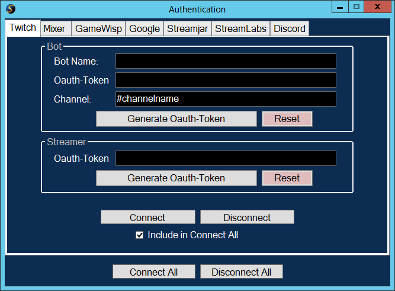
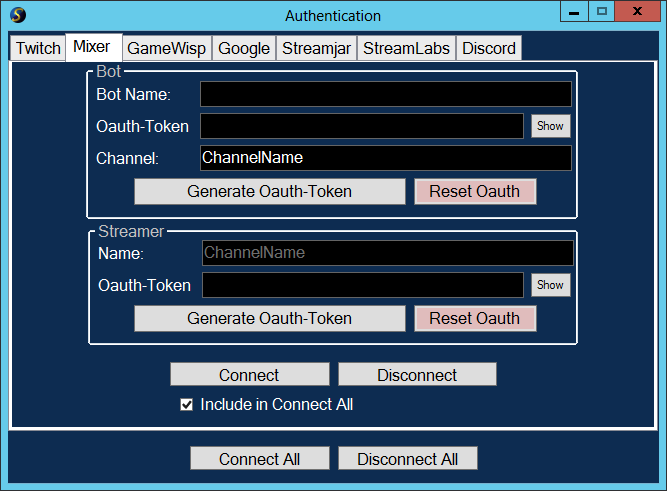
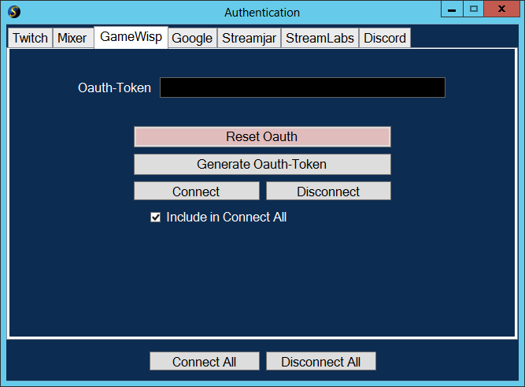
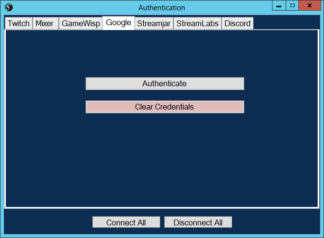
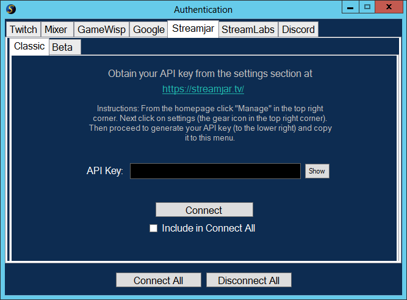
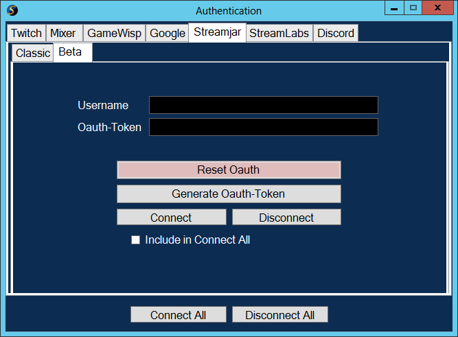
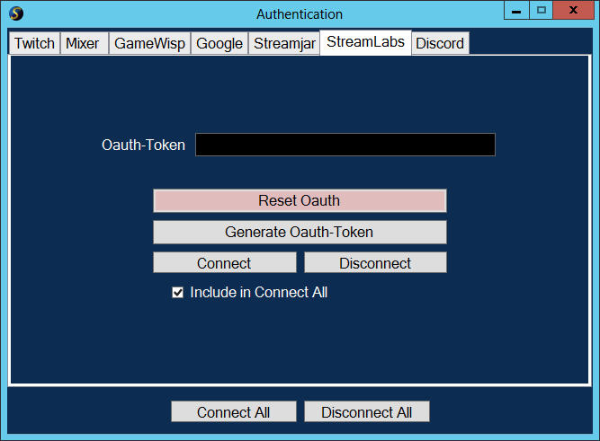
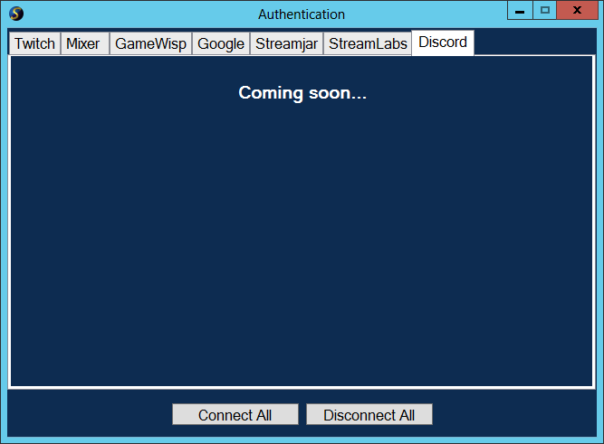

# Getting Started

## Key Terms

### Connect All
This will connect all interfaces that have the "Include in Connect All" checkbox checked.

### Disconnect All
This will disconnect all interfaces that have the "Include in Connect All" checkbox checked.

## Twitch Authentication
Test

## Mixer Authentication

## GameWisp Authentication

## Google Authentication

## Streamjar Authentication
### Classic

### Beta

## StreamLabs Authentication

## Discord Authentication
Discord Authentication is still in-progress and is unavailable.

